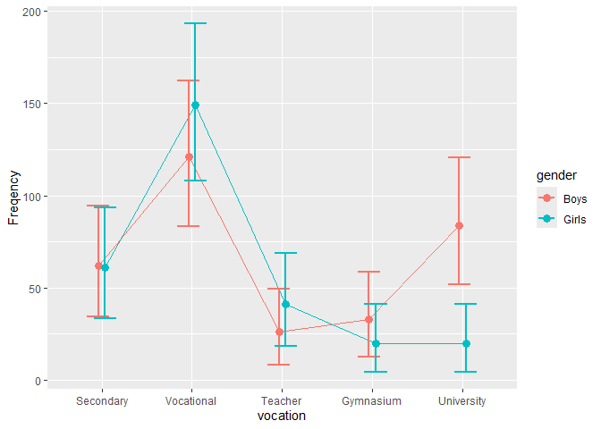

# ANOFA: Analyses of Frequency Data

<!-- badges: start -->

[](https://cran.r-project.org/package=ANOFA)
<!-- badges: end -->

The library `ANOFA` provides easy-to-use tools to analyze frequency
data. It does so using the *Analysis of Frequency datA* (ANOFA)
framework (the full reference Laurencelle & Cousineau, 2023). With this
set of tools, you can examined if classification factors are non-equal
(*have an effect*) and if their interactions (in case you have more than
1 factor) are significant. You can also examine simple effects (a.k.a.
*expected marginal* analyses). Finally, you can assess differences based
on orthogonal contrasts. ANOFA also comes with tools to make a plot of
the frequencies along with 95% confidence intervals (these intervals are
adjusted for pair- wise comparisons Cousineau, Goulet, & Harding, 2021);
with tools to compute statistical power given some *a priori* expected
frequencies or sample size to reach a certain statistical power. In sum,
eveything you need to analyse frequencies!

The main function is `anofa()` which provide an omnibus analysis of the
frequencies for the factors given. For example, Light & Margolin (1971)
explore frequencies for attending a certain type of higher education as
a function of gender:

``` r
w <- anofa( obsfreq ~ vocation * gender, LightMargolin1971)
summary(w)
```

    ##                       G df Gcorrected pvalue    etasq
    ## Total           266.889  9         NA     NA       NA
    ## vocation        215.016  4    214.668 0.0000 0.258428
    ## gender            1.986  1      1.985 0.1589 0.003209
    ## vocation:gender  49.887  4     49.555 0.0000 0.301949

A plot of the frequencies can be obtained easily with

``` r
anofaPlot(w) 
```

<!-- -->

Owing to the interaction, simple effects can be analyzed from the
*expected marginal frequencies* with

``` r
e <- emFrequencies(w, ~ gender | vocation )
summary(e)
```

    ##                            G df Gcorrected pvalue    etasq
    ## gender | Secondary   0.00813  1   0.008124 1.0000 0.000066
    ## gender | Vocational  2.90893  1   2.906575 0.5736 0.010659
    ## gender | Teacher     3.38684  1   3.384098 0.4957 0.048118
    ## gender | Gymnasium   3.22145  1   3.218840 0.5219 0.057299
    ## gender | University 42.34782  1  42.313530 0.0000 0.289364

Follow-up functions includes contrasts examinations with
\`contrastFrequencies()’.

Power planning can be performed on frequencies using `anofaPower2N()` or
`anofaN2Power()` if you can determine theoretical frequencies.

Finally, `toRaw()`, `toCompiled()`, `toTabular()`, `toLong()` and
`toWide()` can be used to present the frequency data in other formats.

# Installation

Note that the package is named using UPPERCASE letters whereas the main
function is in lowercase letters.

The official **CRAN** version can be installed with

``` r
install.packages("ANOFA")
library(ANOFA)
```

The development version 0.2.2 can be accessed through GitHub:

``` r
devtools::install_github("dcousin3/ANOFA")
library(ANOFA)
```

The library is loaded with

``` r
library(ANOFA)
```

# For more

As seen, the library `ANOFA` makes it easy to analyze frequency data.
Its general philosophy is that of ANOFAs.

The complete documentation is available on this
[site](https://dcousin3.github.io/ANOFA/).

A general introduction to the `ANOFA` framework underlying this library
can be found at *the Quantitative Methods for Psychology* Laurencelle &
Cousineau (2023).

# References

<div id="refs" class="references csl-bib-body hanging-indent"
entry-spacing="0" line-spacing="2">

<div id="ref-cgh21" class="csl-entry">

Cousineau, D., Goulet, M.-A., & Harding, B. (2021). Summary plots with
adjusted error bars: The superb framework with an implementation in R.
*Advances in Methods and Practices in Psychological Science*, *4*, 1–18.
<https://doi.org/10.1177/25152459211035109>

</div>

<div id="ref-lc23b" class="csl-entry">

Laurencelle, L., & Cousineau, D. (2023). Analysis of frequency tables:
The ANOFA framework. *The Quantitative Methods for Psychology*, *19*,
173–193. <https://doi.org/10.20982/tqmp.19.2.p173>

</div>

<div id="ref-lm71" class="csl-entry">

Light, R. J., & Margolin, B. H. (1971). An analysis of variance for
categorical data. *Journal of the American Statistical Association*,
*66*, 534–544. <https://doi.org/10.1080/01621459.1971.10482297>

</div>

</div>
